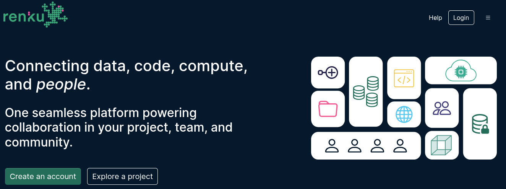
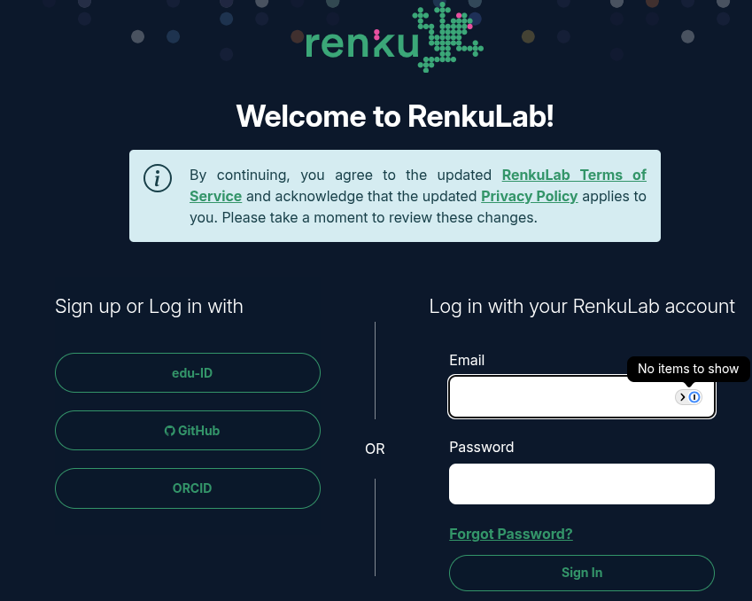
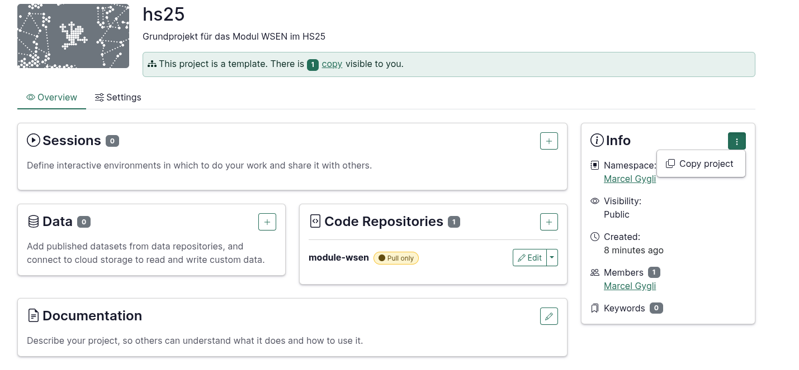
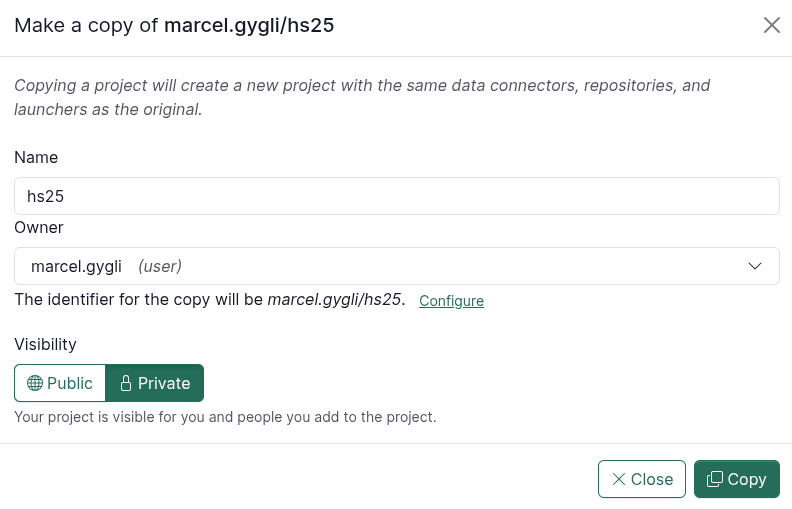
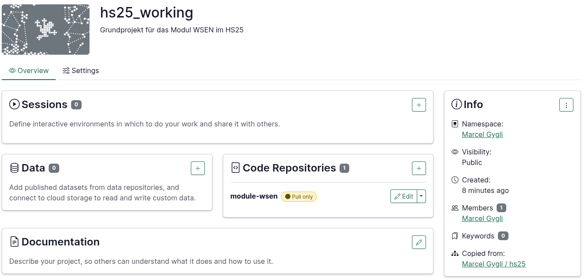
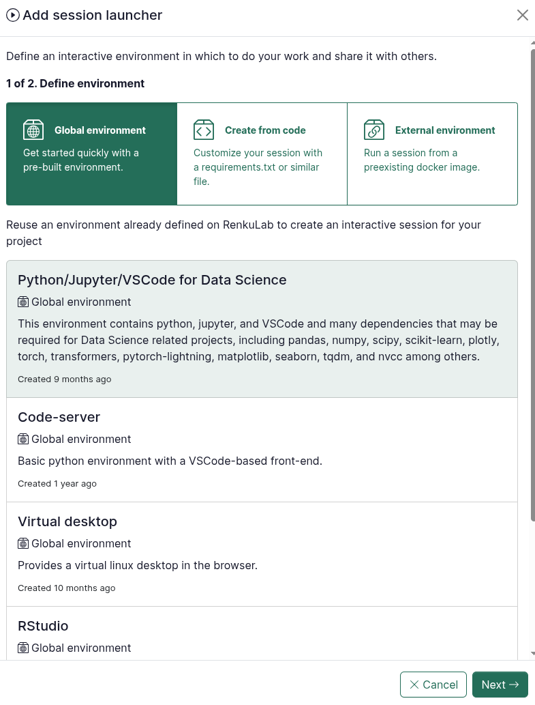
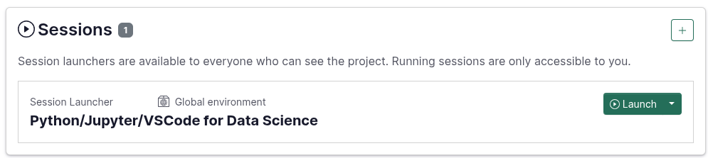

# Software-Entwicklung HS25

## Einführung

In diesem Projekt findest du alle Unterlagen für das Semester HS25 des Moduls Software-Entwicklung an der Berner Fachhochschule.

## Arbeiten mit Renkulab

Um den Einstieg ins Programmieren nicht mit Installieren und Konfigurieren von Software zu erschweren haben wir uns entschieden auf Renkulab zu setzen. 

## Repository forken

Damit Renkulab **automatisch** deine Arbeiten speichern kann musst du eine  **Kopie** erstellen. Gehe dazu folgendermassen vor:

### Erstelle einen Account

- Klicke auf **Login**:

- Wähle SWITCH edu-ID:

### Erstelle eine Kopie
- Öffne das Grundprojekt: [HS25](https://renkulab.io/p/marcel.gygli/hs25)

- Klicke rechts bei **Info** auf die **3Punkte** und dann **Copy Project**:

- Wähle im Modal die Einstellung **Private** und klicke auf **Copz*

> Der Vorteil von Private ist, dass du nicht ausversehen eine Session startest ohne eingeloggt zu sein. Deine Änderungen können nur gespeichert und wiederhergestellt werden, falls du eingeloggt bist.

- Wir empfehlen dir ein Bookmark zu erstellen damit du schnell und ohne Umwege auf deine Modul Resourcen zugreiffen kannst. 

## Erstellen einer Session

Öffne die von dir erstellte Kopie in Renkulab

Unter **Sessions** klicke auf das **+** Zeichen
Mache folgende Einstellungen im Modal welches sich öffnet:

Klicke auf **Next** und im folgenden Fenster auf **Add Session Launcher**

Danach kann die Session gestartet werden:

